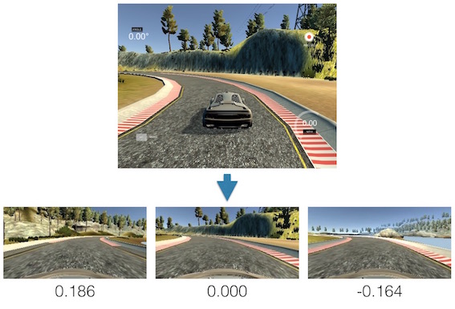
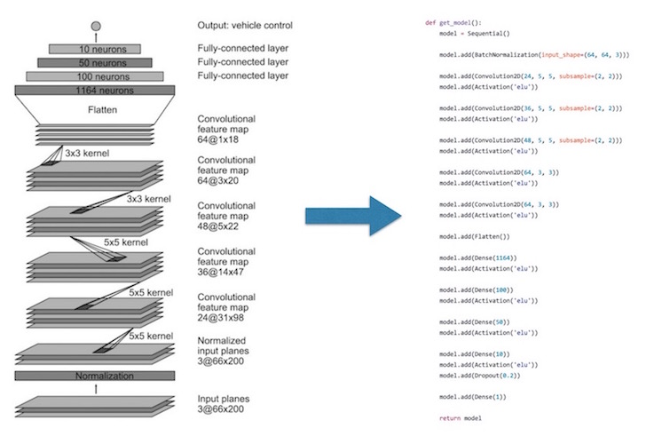
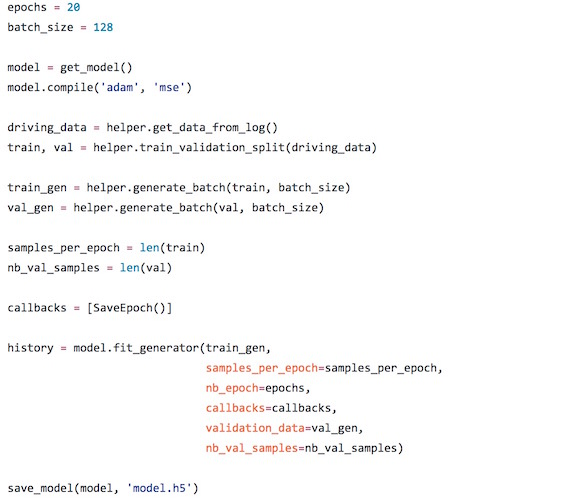
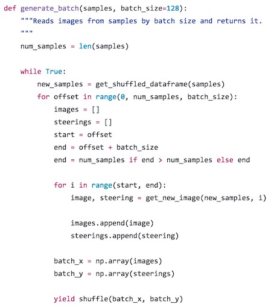
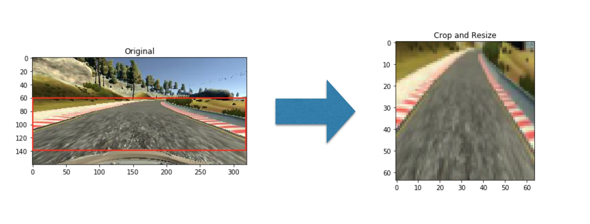
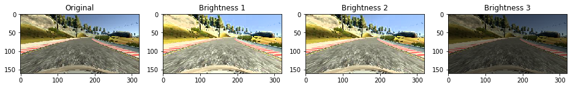
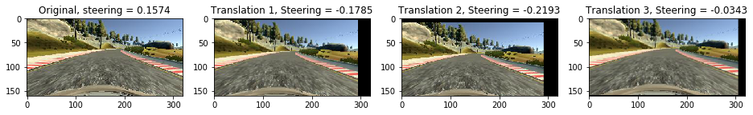
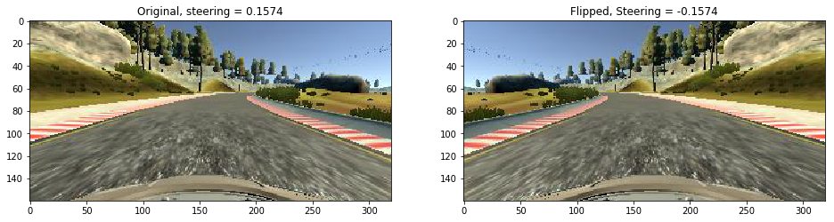
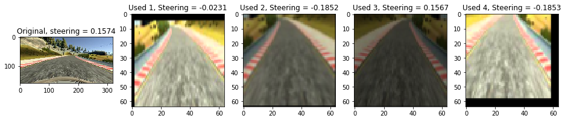

## Behavioral Cloning

딥러닝을 이용한 주행 시뮬레이션

---

## 프로젝트 목표


---

#### Step 1. 시뮬레이터를 통해 주행 데이터를 수집



24108 개의 이미지 데이터를 사용

---

#### Step 2. 핸들의 각도를 예측하는 학습 모델을 제작



<span style="color:gray; font-size: 0.5em;">End to End Learning for Self-Driving Cars by NVIDIA</span>

---

#### Step 3. 수집한 데이터를 통해 모델을 학습



---

#### Point 1. Generator 사용



---

#### Point 2. 학습 데이터 증강

+++

Crop 및 Resize

```python
def crop_and_resize(image, top=60, bottom=25, size=(64, 64)):
    """
    After crop top and bottom, resize image.
    """
    row = image.shape[0]
    cropped = image[top:row-bottom, :]
    resized = imresize(cropped, size)
    return resized
```

+++

Crop 및 Resize



+++

랜덤 밝기 조절

```python
def random_brightness(image, brightness=0):
    """Adjusts randomly brightness of the image.
    """
    if brightness == 0:
        brightness = np.random.uniform(0.15, 2.0)
    hsv = cv2.cvtColor(image, cv2.COLOR_BGR2HSV)
    v = hsv[:, :, 2]
    hsv[:, :, 2] = np.where(v * brightness > 255, 255, v * brightness)
    image = cv2.cvtColor(hsv, cv2.COLOR_HSV2BGR)
    return image
```

+++

랜덤 밝기 조절



+++

수평, 수직 랜덤 이동

```python
def random_translate(image, steering):
    """Moves the image randomly.
    """
    rows = image.shape[0]
    cols = image.shape[1]

    px = int(image.shape[1] / 10)
    py = int(image.shape[0] / 10)

    x = np.random.uniform(-px, px)
    y = np.random.uniform(-py, py)
    steering = steering + (x / px * 0.4)

    M = np.float32([[1, 0, x], [0, 1, y]])

    return cv2.warpAffine(image, M, (cols, rows)), steering
```

+++

수평, 수직 랜덤 이동



+++

랜덤하게 뒤집기

```python
def random_flip(image, steering_angle, prob=0.5):
    """Flips the image randomly.
    """
    if np.random.rand() < prob:
        return np.fliplr(image), -steering_angle
    else:
        return image, steering_angle
```

+++

랜덤하게 뒤집기



+++

최종 학습 이미지



---
#### 결론

 - 데이터가 중요
 - 딥러닝을 위해서는 GPU 가 필수
 - 결과를 이해하기 위해 모델과 데이터에 대한 이해가 필요
