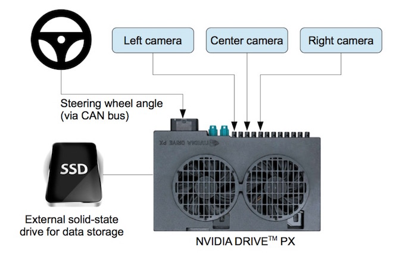

## Behavioral Cloning

딥러닝을 이용한 운전 시뮬레이션
---

## 프로젝트의 목적

이미지 패턴인식을 통해 핸들의 각도를 예측

---

## 학습 방식

Input: 도로 이미지
Output: 

## Video

---

## End to End

End to End Learning for Self-Driving Cars by NVIDIA

---

## Data from Simulator

---

## Convolutional Neural Network

---
