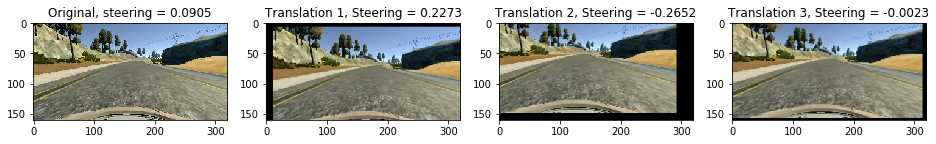

# **Behavioral Cloning**

The goals / steps of this project are the following:
* Use the simulator to collect data of good driving behavior
* Build, a convolution neural network in Keras that predicts steering angles from images
* Train and validate the model with a training and validation set
* Test that the model successfully drives around track one without leaving the road
* Summarize the results with a written report

Getting started
---------------

### Installation & Download

To get started with this project, you need to install and download below:

#### Dependencies

- [Keras](https://keras.io/)
- [NumPy](http://www.numpy.org/)
- [SciPy](https://www.scipy.org/)
- [Scikit-Learn](http://scikit-learn.org/stable/install.html)
- [TensorFlow](http://tensorflow.org)
- [Pandas](http://pandas.pydata.org/)
- [OpenCV](http://opencv.org/)

#### Simulator

- [Windows 64 bit](https://d17h27t6h515a5.cloudfront.net/topher/2016/November/5831f3a4_simulator-windows-64/simulator-windows-64.zip)
- [macOS](https://d17h27t6h515a5.cloudfront.net/topher/2016/November/5831f290_simulator-macos/simulator-macos.zip)
- [Linux](https://d17h27t6h515a5.cloudfront.net/topher/2016/November/5831f0f7_simulator-linux/simulator-linux.zip)


#### Dataset

- [Udacity dataset] (Track1 data provided by Udacity)

[Udacity dataset]: https://d17h27t6h515a5.cloudfront.net/topher/2016/December/584f6edd_data/data.zip

### Run Model

After run simulator as autonomous mode type below in terminal.

    $ python drive.py model.h5

### Train Model

    $ python model.py

Model Architecture and Training Strategy
--------------------------------------

### 1. Model Architecture
I used [NVIDIA's End to End Learning for Self-Driving Cars][] paper almost as it is. My model consisted of 5 convolutional neural networks with 5x5 and 3x3 filter size, and 4 fully connected layers. The model includes ELU layers for activation, and the data is normalized in the model using a Keras BatchNormalization layer. Also I added dropout layer to prevent overfitting just before output layer.


[NVIDIA's End to End Learning for Self-Driving Cars]: http://images.nvidia.com/content/tegra/automotive/images/2016/solutions/pdf/end-to-end-dl-using-px.pdf

### 2. Train data

I used [Udacity dataset] provided with this project that contains Track 1 data.

Udacity dataset consists of 24108 images(8036 images for left, right and center camera). I choose randomly among left, right and center images, and add correction for left and right images.


### 3. Data augmentation

After load image, it is augmented according to the process below.

Image -> Crop and resize -> Random brightness -> Random translation -> Random flip

#### 1. Crop and resize

In the first stage, image is cropped and resized to reduce train noises and time.


#### 2. Random brightness

In the second step, the brightness of the image is randomly adjusted. Brightness adjustment is important because shadows are generated in simulator fast mode or above.


#### 3. Random translation

This is the most important stage I think. Before add this stage, the car couldn't finish the track.




#### 4. Random flip

In the last stage, the image is randomly flipped.


#### 5. Apply all above

The image used in the actual training is to apply all the above methods.


### 4. Training

#### 1. Generator

I used generator for generating data instead of putting all the data in memory. It shuffles the data every epoch.

```python
def generate_batch(samples, batch_size=128):
    """Reads images from samples by batch size and returns it.
    """
    num_samples = len(samples)

    while True:
        new_samples = get_shuffled_dataframe(samples)
        for offset in range(0, num_samples, batch_size):
            images = []
            steerings = []
            start = offset
            end = offset + batch_size
            end = num_samples if end > num_samples else end

            for i in range(start, end):
                image, steering = get_new_image(new_samples, i)

                images.append(image)
                steerings.append(steering)

            batch_x = np.array(images)
            batch_y = np.array(steerings)

            yield shuffle(batch_x, batch_y)
```

#### 2. Training parameters

##### 1. Activation: ELU

I tried tanh, ReLU and ELU. But only ELU works for my model.

##### 2. Epochs: 20

I tried 100 epochs and saved model every epoch, and 20 epochs works well.

##### 3. Other parameters

- Optimizer: Adam
- Batch Size: 128
- Train/Validation split: 0.2
